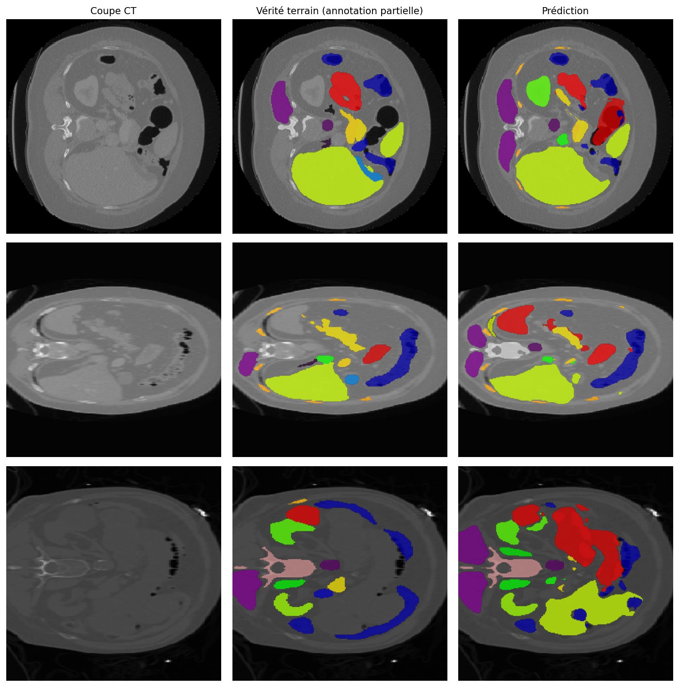

# Segmentation de structures anatomiques sur CT-scan avec annotations partielles

Solution pour le [**Challenge ENS Data #165**](https://challengedata.ens.fr/challenges/165) ([Raidium](https://www.raidium.fr/)) : segmenter jusqu'à 54 structures anatomiques sur des coupes axiales de CT-scan, avec des annotations **incomplètes et hétérogènes**.

| | DICE |
|---|---|
| **Cette solution** | **0.6089** |
| Baseline nnU-Net (organisateurs) | 0.4399 |
| Première version, U-Net *from scratch* | 0.1980 |

**+38 % relatif sur la baseline nnU-Net**. Entraînement sur un seul GPU T4 (Colab, offre gratuite). Aucune donnée ni modèle pré-entraîné radiologique, conformément au règlement.

---

## Le problème

Fusionner des jeux de données annotés est tentant pour entraîner un modèle robuste, mais cela casse l'apprentissage supervisé classique , le foie est étiqueté dans un jeu et compté comme *background* dans un autre. Le modèle reçoit des gradients contradictoires sur la même structure.

Le challenge reproduit cette situation. Pour une image donnée, un organe visible peut être :

- **annoté et présent** dans le masque → positif certain ;
- **annoté et absent** du masque → l'organe n'est pas dans la coupe, c'est un **négatif certain** ;
- **non annoté** → statut inconnu, l'organe peut être présent ou absent.

Le fichier `annotated_labels.json` fournit ce statut. Il n'y a donc pas 54 classes supervisées, mais **un sous-ensemble différent de classes supervisées pour chaque image** — environ 27 sur 54, soit près de 80 % des couples (image, classe) au statut inconnu.

**C'est le cœur du problème, pas l'architecture du réseau.** Toute la solution découle d'une question : comment n'apprendre que sur ce qu'on sait réellement ?

## Données

| | |
|---|---|
| Entraînement | 2 000 coupes axiales 256×256, niveaux de gris |
| — annotées partiellement | 800 |
| — sans aucune annotation | 1 200 |
| Test | 500 coupes, **intégralement** annotées |
| Classes | 54 |

Les coupes sont mélangées : **aucune information 3D**, et aucune indication de l'examen d'origine.

**Métrique** : DICE moyenné par organe, puis par image. Chaque classe pèse `1/54` du score, indépendamment de sa fréquence et de sa taille — une structure rare compte autant que le foie.

## Démarche

### 1. Trancher la nature du problème

Deux lectures possibles du sujet, et le choix détermine toute l'architecture : segmentation sémantique multi-classes (l'identifiant `c` désigne toujours le même organe) ou clustering de pixels image par image (identifiants arbitraires). L'énoncé laisse la question ouverte.

Test mis en place : si `c` désigne un organe fixe, le centroïde de la classe `c` est stable d'une image à l'autre. On compare donc la dispersion *intra-classe* des centroïdes à celle attendue si les identifiants étaient tirés au hasard.

> **18 px** de dispersion intra-classe contre **41 px** pour des identifiants arbitraires.

Les identifiants sont **sémantiques**. Le problème est traité comme une segmentation multi-classes, et la stabilité positionnelle devient un a priori exploitable — avec une conséquence directe sur l'augmentation (§4).

### 2. Loss masquée plutôt que softmax

- **54 sorties sigmoïde indépendantes, pas un softmax.** Le softmax normalise sur toutes les classes, y compris celles au statut inconnu : il propagerait du gradient sur des étiquettes qui n'existent pas. Des sigmoïdes indépendantes permettent de masquer classe par classe.
- **Gradient uniquement sur les couples (image, classe) de statut certain.** Chaque classe étant supervisée sur un nombre comparable d'images, une moyenne uniforme sur les couples connus estime la macro-moyenne par classe de la métrique sans repondération.
- **DICE sur les positifs connus, BCE sur tous les couples connus.** Les négatifs certains (≈ 15 % des couples) apprennent au modèle *où un organe n'est pas* : supervision gratuite, extraite du seul `annotated_labels.json`.
- **Tête auxiliaire de présence** au niveau image. La métrique ne pénalise pas une classe absente non prédite, mais compte zéro pour une classe prédite à tort : décider de la présence avant de segmenter est directement rentable.

### 3. Un protocole d'évaluation honnête

Deux pièges, susceptibles tous les deux de rendre le score local purement décoratif.

**Fuite entre coupes voisines.** Les coupes d'un même examen se ressemblent énormément et sont mélangées dans le jeu ; un split aléatoire placerait des quasi-doublons de part et d'autre. Les images sont regroupées par similarité cosinus sur vignettes réduites, puis par composantes connexes, et **chaque groupe reste entièrement d'un seul côté** du split.

**Validation optimiste.** En validation, les classes au statut inconnu sont masquées : une classe prédite à tort y est *exclue* du calcul, alors qu'elle compterait zéro sur le test intégralement annoté. Chaque évaluation renvoie donc deux bornes — l'une avec masquage (optimiste), l'autre sans (pessimiste, où des organes réels mais non annotés passent pour des faux positifs). La calibration des seuils est optimisée sur la **borne pessimiste**, celle qui pénalise les faux positifs comme le fera le test.

> Validation borne optimiste **0.6290**, leaderboard **0.6089** : l'encadrement a correctement prédit où tomberait le score réel.

### 4. Augmentation contrainte par l'anatomie

Deux augmentations standard sont ici **nuisibles**, et le diagnostic du §1 explique pourquoi.

- **Rotations de 90° : supprimées.** Les identifiants sont identifiables *parce que* la position est stable. Faire pivoter une coupe axiale d'un quart de tour détruit exactement ce signal.
- **Miroir horizontal : désactivé.** Retourner l'image sans échanger les étiquettes gauche/droite apprend au modèle que le rein gauche et le rein droit sont interchangeables. Une détection de latéralité a été mise en place — décalage signé des centroïdes par rapport au **centre du corps mesuré sur chaque image**, co-occurrence conditionnée aux images où les deux classes sont annotées — mais elle ne fait ressortir qu'une paire crédible. Une table d'échange incomplète étant plus nuisible que pas de miroir du tout, l'augmentation reste désactivée.

Conservées : rotations faibles (±15°), mise à l'échelle, translation, jitter d'intensité.

### 5. Architecture et entraînement

U-Net avec encodeur **ResNet34 pré-entraîné ImageNet** — autorisé, le règlement n'interdisant que les sources *radiologiques* externes. Tête de présence auxiliaire.

AdamW à deux groupes de paramètres (encodeur `1e-4`, décodeur `3e-4`), planification cosinus, précision mixte, batch de 8, 250 epochs. Checkpoint complet et reprise automatique à chaque epoch : sur Colab gratuit, une déconnexion ne coûte qu'une epoch.

### 6. Post-traitement

- **Calibration conjointe** du seuil pixel et du seuil de présence sur grille, optimisée sur la borne pessimiste. Gain obtenu sans rien réentraîner.
- **Rattrapage des images vides.** Quelques images de test ne recevaient aucune prédiction, donc zéro sur toutes leurs classes réelles. Elles sont repassées à seuils très bas : prédire quelque chose, même imparfaitement, ne peut pas faire moins bien.

## Résultats qualitatifs



Coupe brute, annotation de référence et prédiction. La référence est **partielle** : plusieurs organes visibles n'y sont pas annotés. Les structures prédites qui n'apparaissent pas au centre ne sont donc pas nécessairement des faux positifs — c'est précisément ce que la métrique du challenge, calculée sur un test intégralement annoté, permet de trancher.

## Limites et pistes

- **Les 1 200 images non annotées ne sont pas exploitées.** C'est la limite principale. Elles sont fournies pour un usage non supervisé et constituent la piste la plus prometteuse du sujet : pré-entraînement auto-supervisé de l'encodeur, pseudo-labels à seuil de confiance, ou entraînement *student–teacher* à consistance. Le règlement autorise les modèles non radiologiques type SAM ou DINOv2, ce qui ouvre une autre voie sur ces mêmes images.
- **Une seule partition de validation.** Avec des classes vues moins de vingt fois, le DICE par classe est bruité ; une validation croisée par groupes donnerait des intervalles interprétables.
- **Latéralité non résolue.** Identifier les paires gauche/droite débloquerait le miroir horizontal et, avec lui, le TTA par symétrie — déjà implémenté mais inutilisable en l'état.
- **Aucune information 3D.** Les coupes sont mélangées, mais les regroupements par similarité reconstituent partiellement les examens : un contexte inter-coupes reste envisageable.
- **Structures rares.** Chaque classe pesant `1/54`, l'essentiel du score restant à gagner se trouve sur les classes les moins fréquentes, où le modèle est le plus faible.

## Reproduire

Les données ne sont pas redistribuées ici : elles s'obtiennent sur la page du challenge, après inscription au [Challenge Data ENS](https://challengedata.ens.fr/).

Arborescence attendue dans `MyDrive/radium_challenge/` :

```
train-images.zip
test-images.zip
label_*.csv
annotated_labels.json
```

Le notebook `raidium.ipynb` s'exécute sur Colab (GPU T4) : chargement → métrique officielle vectorisée → diagnostic → supervision et split par groupes → latéralité → modèle et loss masquée → entraînement → calibration → soumission. Les images sont extraites sur le disque local et mises en cache en `.npy` ; seuls ces caches agrégés reviennent sur Drive.


---

**Contact** — `<nom>` · `<email>` · `<LinkedIn>`
Training	250 epochs, T4 GPU
